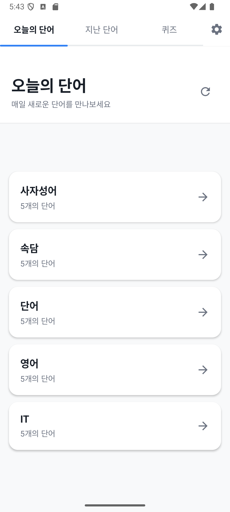
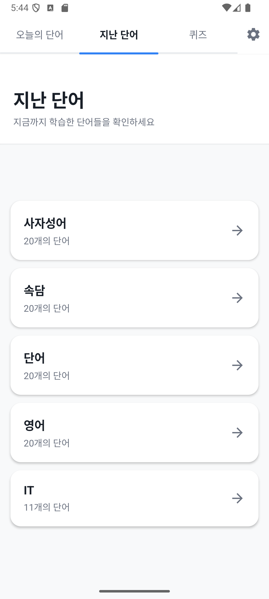
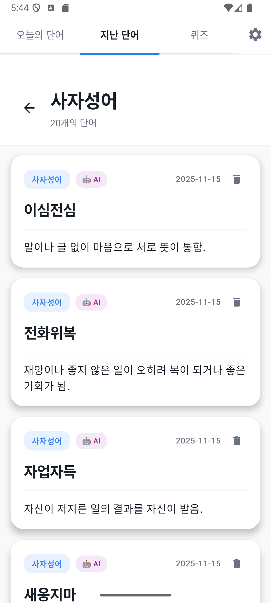
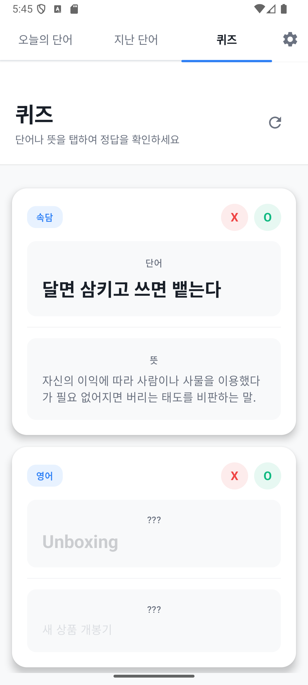
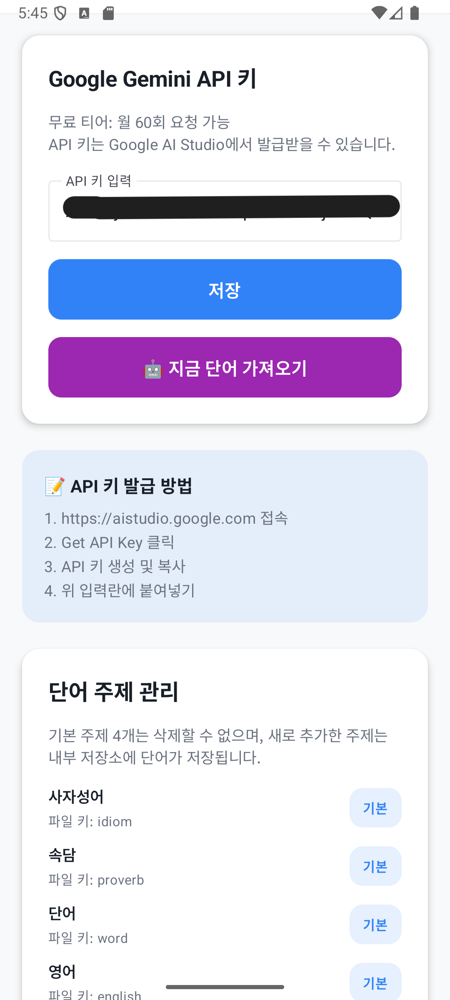

# Eunoia - 단어 학습 앱

매일 새로운 단어를 만나고 학습할 수 있는 안드로이드 앱입니다.

## 주요 기능

### 📚 단어 학습

- **오늘의 단어**: 매일 새로운 단어를 AI로 자동 생성
- **지난 단어**: 학습한 모든 단어를 주제별로 확인
- **퀴즈**: 단어 암기 확인 및 맞춤형 복습

### 🤖 AI 단어 생성

- Google Gemini API를 활용한 지능형 단어 생성
- 주제별 맞춤 단어 추천 (사자성어, 속담, 영어, 단어 등)
- 사용자 정의 주제 지원 (예: IT, 회화 등)

### ✏️ 직접 단어 추가

- 원하는 단어와 뜻을 직접 추가
- 주제별 분류 및 관리

### 📊 주제 관리

- 기본 주제: 사자성어, 속담, 단어, 영어
- 사용자 정의 주제 추가/삭제
- 주제별 단어 통계 확인

### 🎯 스마트 퀴즈

- 최대 30개 단어 제공
- 날짜별 가중치 적용 (최근 단어 우선)
- O/X 버튼으로 정답 여부 표시
- 맞춤형 복습 알고리즘 (틀린 단어 우선 출현)

## 기술 스택

- **언어**: Kotlin
- **UI**: Jetpack Compose (Material 3)
- **아키텍처**: MVVM 패턴
- **API**: Google Gemini API
- **백그라운드 작업**: WorkManager
- **데이터 저장**: SharedPreferences, JSON 파일

## 시작하기

### 1. API 키 설정

1. [Google AI Studio](https://aistudio.google.com) 접속
2. API 키 생성 및 복사
3. 앱 설정 화면에서 API 키 입력

### 2. 단어 가져오기

- **자동**: 앱 실행 시 오늘 처음 열면 자동으로 단어 생성
- **수동**: 설정 화면에서 "지금 단어 가져오기" 버튼 클릭

### 3. 단어 학습

- **오늘의 단어**: 오늘 생성된 단어 확인
- **지난 단어**: 주제별로 과거 단어 확인
- **퀴즈**: 단어 암기 확인 및 복습

## 빌드 방법

자세한 빌드 가이드는 [BUILD_APK.md](BUILD_APK.md)를 참고하세요.

### 빠른 빌드 (디버그)

```bash
./gradlew assembleDebug
```

### 릴리스 빌드

```bash
./gradlew assembleRelease
```

## 프로젝트 구조

```
app/src/main/java/com/ljk/eunoia/
├── ai/                    # AI 서비스 (Gemini API)
├── data/                  # 데이터 모델
├── ui/
│   ├── components/        # 재사용 가능한 UI 컴포넌트
│   ├── screens/          # 화면 구성
│   │   └── tabs/         # 탭 화면들
│   └── theme/            # 테마 및 스타일
├── utils/                 # 유틸리티 클래스
│   ├── FileManager       # 파일 관리
│   ├── CategoryManager   # 주제 관리
│   └── WorkManagerHelper # 백그라운드 작업
└── workers/              # WorkManager 작업
```

## 주요 화면

- **오늘의 단어**: 주제별로 그룹화된 오늘의 단어 목록
- **지난 단어**: 주제별로 그룹화된 과거 단어 목록
- **퀴즈**: 단어 암기 확인 및 복습
- **설정**: API 키 관리, 주제 관리, 단어 추가

<div style="overflow-x: auto; white-space: nowrap;">
  
  
  
  
  
</div>

## 라이선스

이 프로젝트는 개인 사용 목적으로 제작되었습니다.
